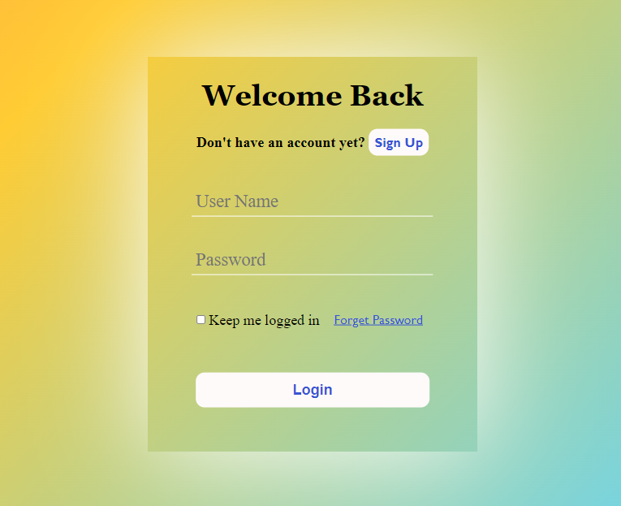
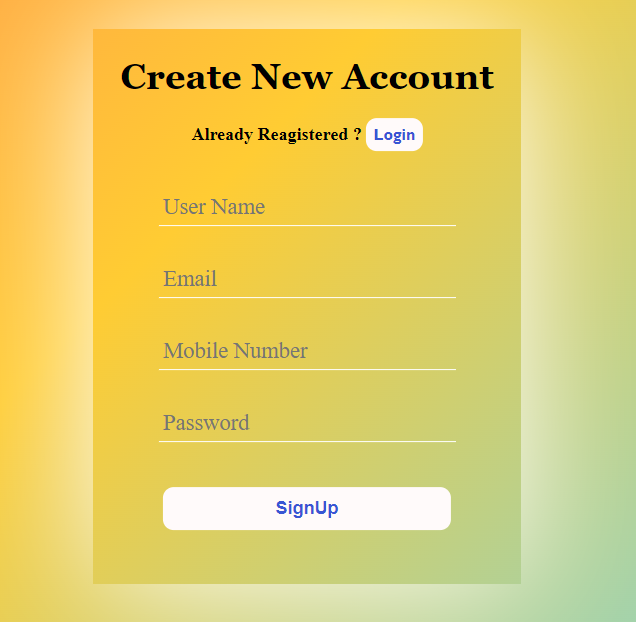

# Project Nexus

This repository contains two projects developed during my internship:

1. **Project 1**: Login and Signup Page (Front-end Alone) - HTML & CSS
2. **Project 2**: Restaurant Signup and Login Authentication (Django)

---

## Table of Contents
1. [Project 1: Login and Signup Page (Front-end Alone)](#project-1-login-and-signup-page-front-end-alone)
2. [Project 2: Restaurant Signup and Login Authentication](#project-2-restaurant-signup-and-login-authentication)

---

## Project 1: Login and Signup Page (Front-end Alone)

### Description
This project contains the front-end implementation of a login and signup page, built using HTML and CSS. It is designed to be clean and responsive, but it does not include backend functionality.

### Features
- HTML structure for both login and signup forms.
- CSS for responsive and visually appealing forms.

### Usage
1. **Clone the repository**:
    ```bash
    git clone https://github.com/Karthik-Mohan19/project-nexus.git
    ```

2. Open `signup.html` or `login.html` in your browser to view the login and signup page.

### Screenshot



---

## Project 2: Restaurant Signup and Login Authentication

### Description
This project is a Django-based restaurant signup and login system that includes user authentication. Users can register and log in securely following password validation rules.

### Features
- User registration with form validation.
- Secure login system with Django’s built-in authentication.
- Password rules:
  - Minimum 8 characters.
  - Must include at least 1 letter and 1 number.

### Installation and Setup
1. **Clone the repository**:
    ```bash
    git clone https://github.com/Karthik-Mohan19/project-nexus.git
    ```
2. **Navigate to the project folder**:
   ```bash
    cd project-nexus
    ```
   ```bash
    cd Restaurant_project
    ```
4. **Install dependencies**:
    Make sure to have `pip` installed and run:
    ```bash
    pip install -r requirements.txt
    ```
5. **Migrate the database**:
    ```bash
    python manage.py migrate
    ```
6. **Start the server**:
    ```bash
    python manage.py runserver
    ```
7. Open your browser and navigate to `http://127.0.0.1:8000/`.

### Usage
- Go to the signup page to create a new account.
- Log in using the newly created credentials.

---

## License
This repository is licensed under the MIT License. See the [LICENSE](LICENSE) file for more information.
